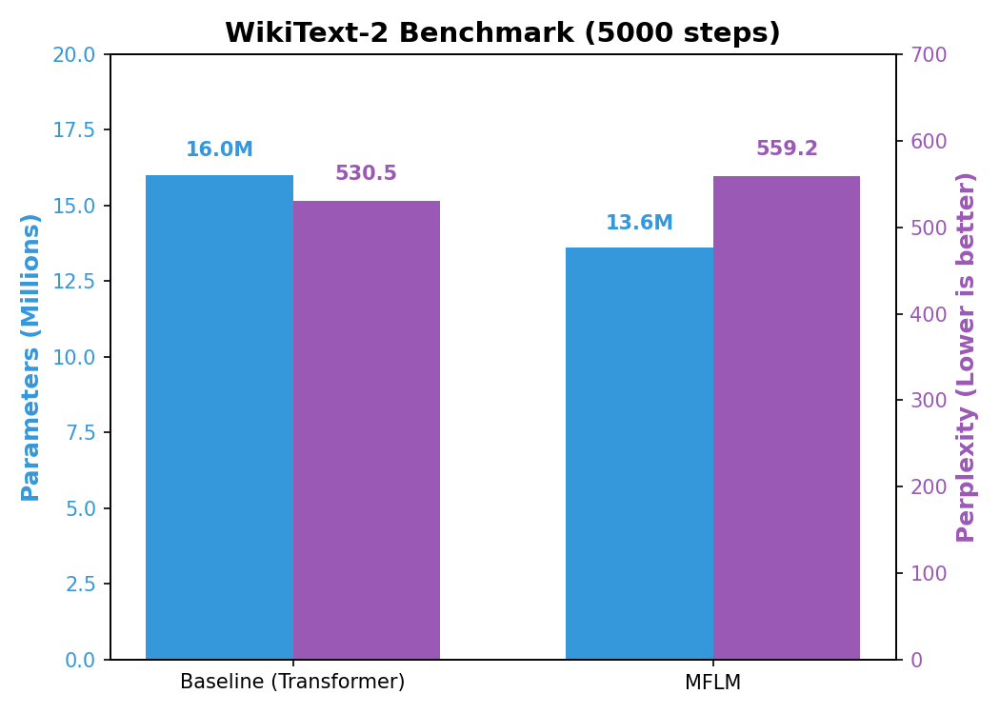
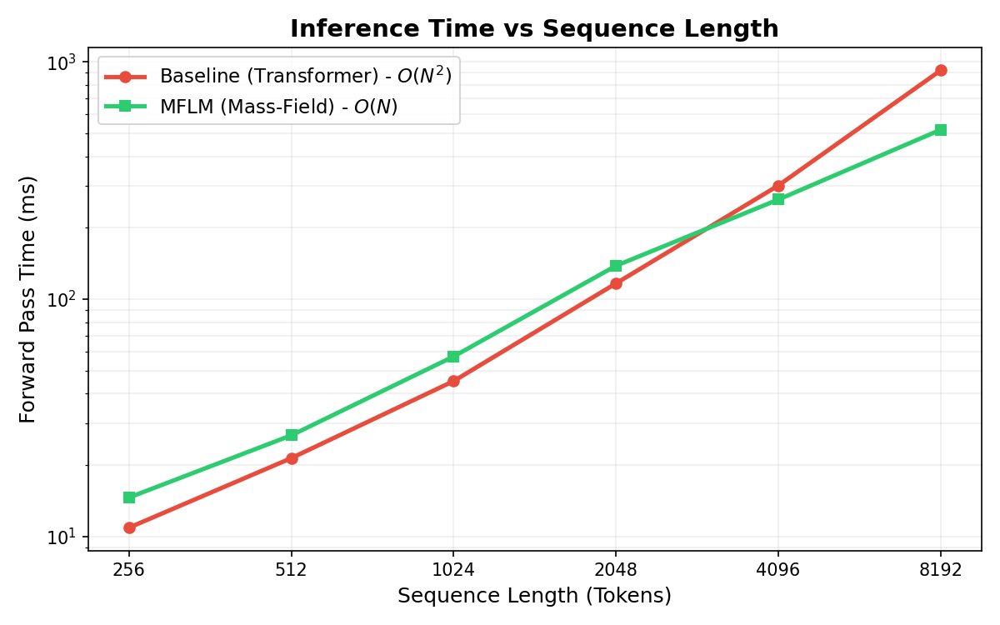
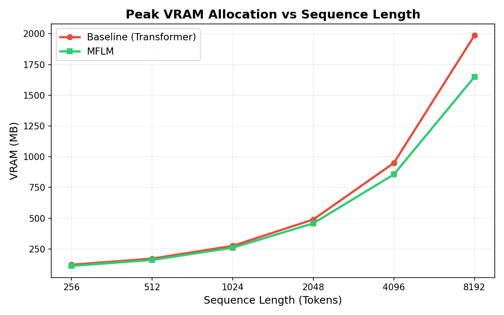

# MFLM: Mass-Field Language Model

This repository contains the reference implementation and experimental probes for the **Mass-Field Language Model (MFLM)**, a sub-quadratic sequence modeling architecture that replaces standard Dot-Product Attention with causal mass-field convolutions.

The primary objective of this research is to investigate whether modeling sequence tokens as physical entities generating continuous, decaying "fields" can match the expressivity of dense attention matrices while strictly maintaining $O(N)$ computational and memory complexity.

## Architecture

MFLM relies on an iterative, weight-tied core module called the `FieldBlock`. Unlike standard Transformers that compute $O(N^2)$ pairwise interactions, MFLM processes sequence context through a localized field propagation mechanism:

1. **Mass & Charge Projection**: The hidden state $X$ is linearly projected into a scalar Mass $M = \tanh(X W_m)$ and a vector Charge $C = X W_c$. Mass can be positive (attractor) or negative (repulsor).
2. **Causal Field Convolution**: The context is aggregated via a depthwise 1D convolution over $(M \odot C)$ using a learned, exponentially decaying kernel. This naturally limits the receptive field while allowing information to propagate continuously.
3. **Iterative Depth**: To build deep representations without parameter bloat, a single `FieldBlock` is iterated $K$ times sequentially (weight-sharing), resembling a Universal Transformer.

## Empirical Results

Our evaluations focus on apples-to-apples comparisons against a standard GPT-style Transformer (BaselineLM) under identical training constraints (seed, learning rate schedule, parameter scale).

### 1. Language Modeling (WikiText-2, ~50M Scale)
*Setup: GPT-2 BPE tokenizer (vocab: 50,257), seq_len=256, trained for 5000 steps on RTX 3050.*



| Model | Parameters | Val PPL | PPL Delta | Complexity |
|-------|------------|---------|-----------|------------|
| BaselineLM (Transformer) | 16.0 M | 530.51 | - | $O(N^2)$ |
| MFLM | 13.6 M | 559.23 | +5.41% | $O(N)$ |

**Analysis**: MFLM converges stably but currently yields a slightly worse perplexity (+5.4%) compared to the standard Transformer baseline. However, it achieves this utilizing **15% fewer parameters** due to the absence of $Q/K/V$ projection matrices.

### 2. Long Context Scaling Efficiency
*Setup: Forward-pass benchmark evaluating inference time (ms) and peak VRAM allocated (MB) across increasing sequence lengths. Models initialized at `d_model=256`.*




| Sequence Length | Baseline Time (ms) | MFLM Time (ms) | Baseline VRAM (MB) | MFLM VRAM (MB) |
|-----------------|--------------------|----------------|--------------------|----------------|
| 256             | 10.9               | 14.6           | 122.2              | 112.4          |
| 1024            | 45.2               | 57.4           | 275.5              | 260.3          |
| 2048            | 116.6              | 138.4          | 489.8              | 458.6          |
| **4096**        | **301.4**          | **263.0**      | **949.2**          | **856.1**      |
| **8192**        | **921.3**          | **517.8**      | **1985.8**         | **1648.7**     |

**Analysis**: The $O(N)$ asymptotic advantage of MFLM emerges empirically at sequence lengths $> 4096$. At short lengths, the constant overhead of iterating the `FieldBlock` 6 times makes MFLM marginally slower. However, at $N=8192$, the quadratic scaling of the Transformer dominates, causing MFLM to run **1.7x faster** while consuming **17% less VRAM**.

## Limitations & Future Work

To maintain scientific rigor, we note the following current limitations:
1. **Scale**: The architecture has only been empirically validated up to the ~50M parameter regime. Scaling laws beyond 100M parameters remain untested.
2. **Absolute Performance**: At equal training steps, MFLM does not currently strictly outperform the Transformer baseline in perplexity, suggesting the field mechanism may require longer training horizons or higher-dimensional capacity to match dense attention.
3. **Exoskeleton Mode**: Preliminary work exists (`src/mflm/exoskeleton.py`) to fuse MFLM as a long-context adapter for pre-trained LLMs (e.g., Qwen), but this remains experimental and unbenchmarked.

## Reproducibility

This repository contains all necessary scripts to reproduce the findings reported above.

**1. Installation**
```bash
pip install torch transformers tiktoken datasets peft
```

**2. Prepare Dataset**
```bash
python bench/prepare_wikitext.py
```

**3. Run LM Benchmark (WikiText-2)**
```bash
python bench/train_wikitext.py --size small --steps 5000
```

**4. Run Long Context Scaling Benchmark**
```bash
python bench/test_long_context.py
```
